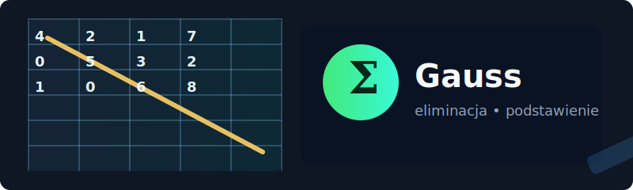

# 🧮 Implementacja Eliminacji Gaussa i Podstawienia Wstecznego

&nbsp;&nbsp;

<p align="center">
	
</p>

Kolorowe, czytelne i praktyczne README projektu implementującego eliminację Gaussa oraz podstawienie wsteczne w C.

## ✨ Szybkie spojrzenie
- **Cel:** Rozwiązanie układów równań liniowych metodą eliminacji Gaussa + podstawienia wstecznego.
- **Język:** C
- **Pliki wejściowe:** `dane.txt`, `dane_test_gauss.txt`

## 🗂️ Struktura projektu
- `Implementacja_eliminacji_gaussa.c` / `.h` — funkcje do eliminacji Gaussa
- `Implementacja_podstawienia_wstecznego.c` / `.h` — funkcje do podstawienia wstecznego
- `main.c` / `main` — przykład uruchomienia programu
- `Test_Implementacji_gaussa.c`, `Test_Implementacji_wstecznej.c` — testy jednostkowe / demonstracyjne
- `dane.txt`, `dane_test_gauss.txt` — przykładowe dane wejściowe

## 🛠️ Kompilacja
Użyj `clang` (lub `gcc`) do skompilowania wszystkich plików źródłowych.

```bash
clang -g main.c Implementacja_eliminacji_gaussa.c Implementacja_podstawienia_wstecznego.c -o main
# lub z gcc
gcc -g main.c Implementacja_eliminacji_gaussa.c Implementacja_podstawienia_wstecznego.c -o main
```

> Tip: W VS Code możesz użyć zadania `C/C++: clang build active file` skonfigurowanego w projekcie.

## ▶️ Uruchamianie
Przykład uruchomienia programu z plikiem danych:

```bash
./main dane.txt
# lub użyj pliku testowego
./main dane_test_gauss.txt
```

Po uruchomieniu program wypisze (lub zapisze) rozwiązanie układu równań oraz informacje diagnostyczne o postępie eliminacji.

## ✅ Przykłady/Scenariusze testowe
- Test podstawowy: `dane_test_gauss.txt` — mały układ testowy do weryfikacji poprawności.
- Test rzeczywisty: `dane.txt` — realne dane do analizy.

## 🧪 Jak testować
- Uruchom testy/demonstracje znajdujące się w `Test_Implementacji_gaussa.c` i `Test_Implementacji_wstecznej.c` (jeśli to programy wykonywalne, skompiluj analogicznie jak `main`).

## 📝 Uwagi implementacyjne
- Sprawdź obsługę przypadków osobliwych (macierz osobliwa, dzielenie przez zero).
- Możesz rozszerzyć program o pivoting (potrójne wybieranie największego elementu) aby zwiększyć stabilność numeryczną.


